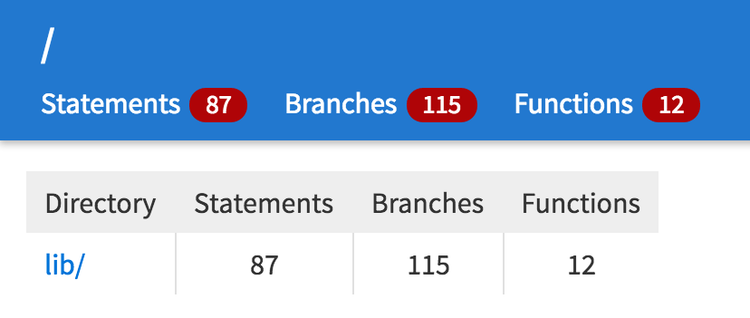
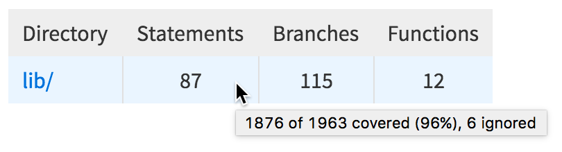
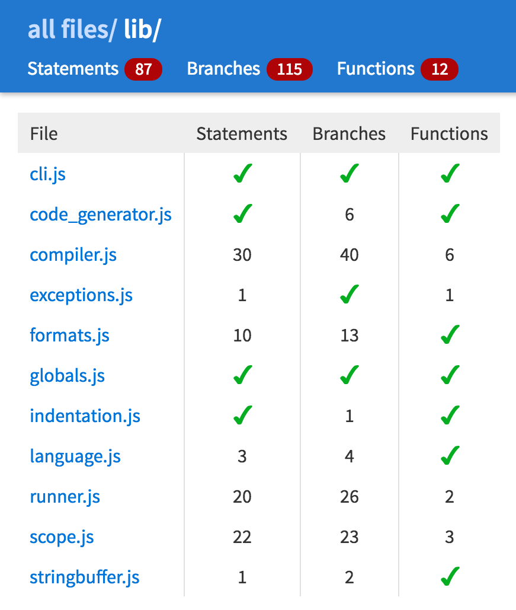
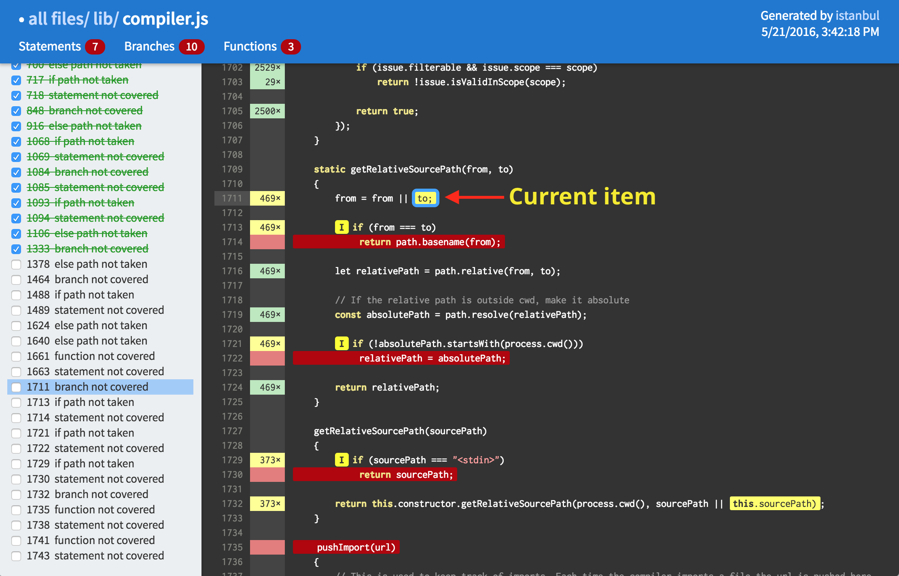
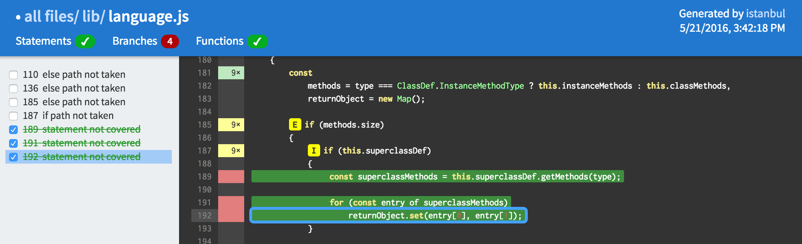

# flow

**flow** is an interactive web app that makes it easy to discover uncovered code and keep track of which uncovered code you have added tests for.

**flow** is designed around a workflow where you want to ensure 100% coverage (hence the name "flow"):

* Run `istanbul cover --report flow`
* Open `coverage/index.html`
* Go through each file
* Add a test to cover each uncovered function/statement/branch, or add an `istanbul ignore` directive.
* Repeat until there are no uncovered lines.

Whereas the **html** report is static, **flow** is a fully interactive web app that dramatically streamlines the process of auditing your code.

## Usage

To use **flow**, run `istanbul cover` as your normally would, using `--report flow` to generate the **flow** web app.

For example, here's a typical command line to run istanbul with mocha:

```
istanbul cover --report html \
node_modules/.bin/_mocha -- --reporter dot
```

Once the **flow** app has been generated, open `coverage/index.html`, where `coverage` is your configured coverage directory.

<p style="padding: .7em 1em; background-color: #FFF5C4; border: 1px solid #E1C84E; border-radius: 3px"><strong>NOTE: flow</strong> requires Chrome, Safari or Firefox, as it uses sessionStorage, which is currently broken on Microsoft browsers.</p>

## Interface

There are three types of views in **flow**:

* Root summary view
* Directory summary view
* File view

### Root summary view

When you open `coverage/index.html`, you see the **root view**.



**flow** strives to keep a clean, uncluttered interface that lets you zero in on the must important information: how much uncovered code remains.
The header for all three views has the same structure:

* At the top is the path to the current directory/file.

* Below that is the total count of uncovered statements, branches, and functions for every item listed on the page.

<p style="padding: .7em 1em; background-color: #D9EBFF; border:1px solid #AFCBE9; border-radius: 3px"><strong>NOTE:</strong> Line counts are not included in <strong>flow</strong>, as it is usually the same as the statement count, and there can be no uncovered lines that do not have an uncovered statement, branch or function.</p>

The summary table of the root view contains one row for each directory that was covered by istanbul. The numbers in each row represent the total count of uncovered statements, branches and functions.

If you want to see detailed information about a given entity, hovering over a number in the header or in the summary table and a tooltip will appear:



Clicking on a directory name in the "Directory" column opens the summary view for that directory.

### Directory summary view

The **directory summary view** is similar to the **root view**, but displays all of the files in a given directory.



A checkmark in a summary cell means that item is completely covered. As with the root view, hovering over a number in the header or summary table displays a tooltip with detailed info.

Clicking on a filename in the "File" column opens the file view for that file.

### File view

The **file view** is where all of the magic happens.



#### Elements of the file view

In addition to the standard header, the **file view** contains the following elements, from left to right:

* **Line number** – The leftmost column displays line numbers for the current file. The line number of the currently selected uncovered item is highlighted.

* **Execution count/status** – The next column displays the execution count and cverage status for each line. Covered lines are green, lines with uncovered statements or functions are red, lines with uncovered branches are yellow.

* **Annotated source code** – The main part of the view contains the file's annotated source code. Uncovered statements and functions are highlighted in red, uncovered branches are highlighted in yellow, and unused if/else paths are marked with a yellow badge ("I" for `if` paths, "E" for `else` paths).

* **Nav bar** – At the right edge of the file view is a scrollable list of all uncovered items in the file. Each nav bar item consists of a checkbox toggle, the line number on which the item occurs, and a description of the item.

#### Navigating items

**flow** makes it easy to navigate through the uncovered items in your source code, and mark which items you have covered with tests or ignored with `istanbul ignore` directives.

There are a number of different ways to navigate through uncovered items:

* Clicking on an item in the nav bar highlights it, scrolls the corresponding item in the source code into view, and outlines the source code item. This is now considered the **current item**.

* Pressing Up/Down Arrow selects the previous/next item in the nav bar, and updates the display as if it had been clicked.

* Clicking on an uncovered item in the source code makes it the current item, selects the corresponding item in the nav bar, and scrolls the nav bar item into view.

When a file view opens, the first uncovered item is selected in the nav bar and in the source code and becomes the **current item**.

#### Tracking fixes

One of the main motivations behind **flow** was to have a way to keep track of fixes to uncovered items without having to rerun istanbul.

When you write a test you think will cover an uncovered item (or use an `istanbul ignore` directive to ignore it), you can mark that item as covered or uncovered by toggling the checkbox next to that item in the nav bar.

<p style="padding: .7em 1em; background-color: #D9EBFF; border:1px solid #AFCBE9; border-radius: 3px"><strong>NOTE:</strong> You can quickly toggle the selected nav bar item using the space bar.</p>

Checking a nav bar item does the following:

* The nav bar item is colored green and struck through to indicate it has been dealt with.

* The corresponding item in the source code is colored green.

* The corresponding count in the header is decremented. If the count reaches zero, a green checkmark is displayed so you can quickly see it has been completely covered.

* The file is marked as modified in the header by prefixing it with "•". In addition, if any file in a directory has been modified, that directory's summary view and the root view will also display "•" in the header to indicate its contents have been modified.

* The next unchecked nav bar item (if any) is selected.

Unchecking a nav bar item does the following:

* The nav bar item loses its color and strikethrough to indicate it is unfixed.

* The corresponding item in the source code reverts to its original color (red or yellow).

* The corresponding count in the header is incremented and displayed in red.

* If there are no checked items in the nav bar, the "•" prefix will be removed from the header. In addition, the parent directory's summary view and the root view will also lose their "•" marker if no more of contents have been modified.

Here is an example of a file where the last three nav bar items have been checked. Since there were only three uncovered statements, the count went to zero and the header status changed to a green checkmark.



Note that toggling items in a file view also updates the relevant uncovered counts in the root and summary views. Thus you are always seeing an up to date representation of what fixes you have made.

**flow** stores your changes in the browser's `sessionStorage` object. There are a couple of things to note:

* Each browser window or tab with the same URL has a separate `sessionStorage` object.

* On Chrome (at least os of version 50.0.2661.102), `sessionStorage` survives across launches of the browser (although according to the spec it should not). On other browsers, closing the **flow** tab or window loses its `sessionStorage`.

* If you run `istanbul cover --report flow` on the same files, the next time you load a view for those files or directories in **flow** the `sessionStorage` will be reset. **flow** does this by comparing a serial number in `sessionStorage` with one that is embedded in the generated html pages.